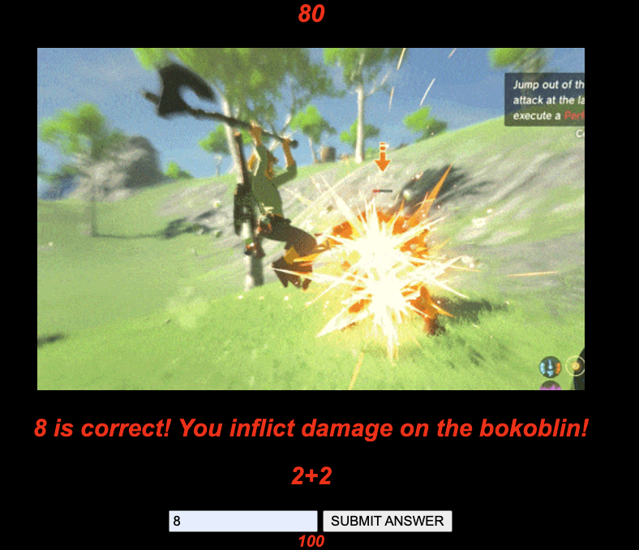

# Code-Hero

Code Hero is a fun and dynamic quiz game that sharpens basic javascript knowledge through Zelda-themed battles. 

Play the game [here](https://breyshaw.github.io/Code-Hero/).

## Motivation: 
I wanted to create an engaging way to review fundamental Javascript concepts. I thought a battle structure of the quiz would be an entertaining and challenging way to make sure one  stays consistent in their Javascript knowledge. I hope this game will help others in need of a fun JavaScript review.

## Game info:

Here is the initial battle wire-frame:

Here is the battle, post styling:

     

In the image the previous question was a True or False.
Once the player's answer is submitted, a new question is randomly generated. Against this specific enemy, submitting the correct answer will deduct 20 points from the enemy's health. If the submitted answer is incorrect, 20 points are deducted from the player's health.

## Technology Implemented:
### Javascript

### CSS

### HTML

### gif

## Stretch Goals:
-Add additional path

-Add more challenge questions

## Credits:

### Font

Zelda Universe's Hylia Serif
https://zeldauniverse.net/media/fonts/

### Images and gifs:

Wake up Link!

    
[Source](https://gfycat.com/sociableaggravatingalligator)

Bokoblin jpeg

[Source](https://oyster.ignimgs.com/mediawiki/apis.ign.com/the-legend-of-zelda-hd/8/88/Bokoblin_pose.jpg)

Lynel jpeg

[Source](https://www.zeldadungeon.net/wiki/images/9/9e/Gold-lynel-artwork.jpg)

Triforce gif

[Source](https://c.tenor.com/S7yo_fqS9GMAAAAM/triforce-ocarina-of-time.gif)

Mop wielding Bokoblin gif

[Source](https://64.media.tumblr.com/8a88c081f5acd1242b4d9e8b792027f8/tumblr_oju8glnAMJ1vy313ho1_500.gifv)

Parry Rush Lynel gif

[Source](https://i.makeagif.com/save/T9JLLu)

Parry Rush Bokoblin gif

[Source](https://64.media.tumblr.com/4f6915cc62d98e7a148f73e4db96cf7c/tumblr_om5t0xlru51tulcmho1_500.gif)

You died Dark Souls gif

[Source](https://i.giphy.com/media/TbONGqAdpTWQW3Hz5V/giphy.webp)
