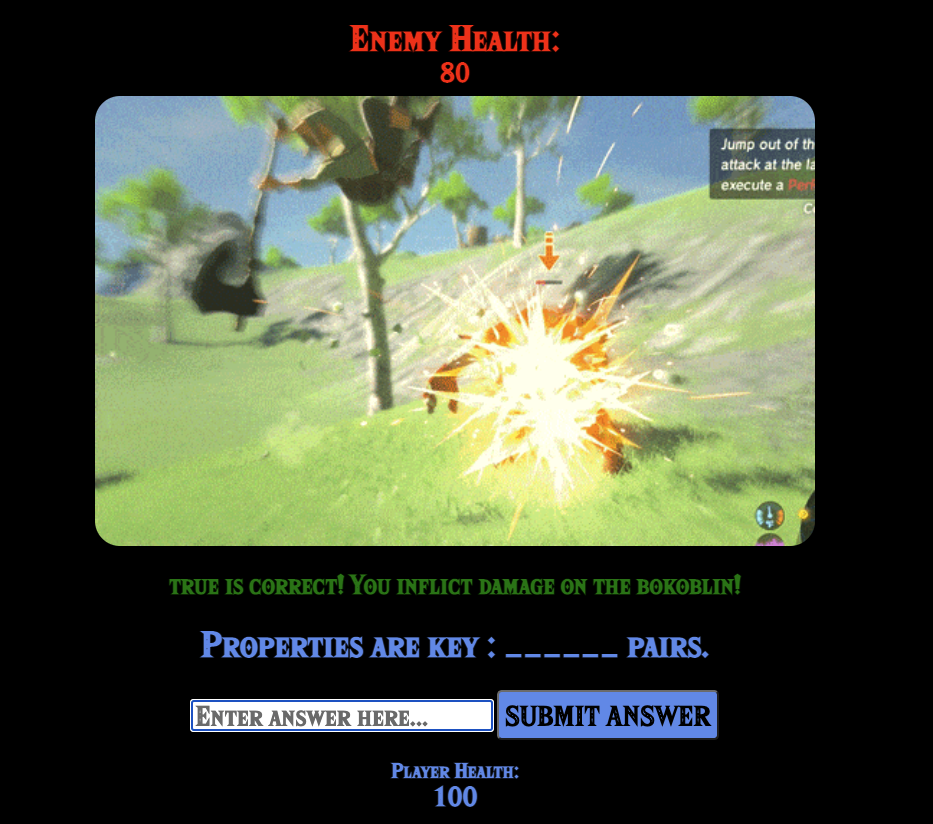

# Code-Hero

Code Hero is a fun and dynamic quiz game that sharpens basic javascript knowledge through Zelda-themed battles. 

Play the game [here](https://breyshaw.github.io/Code-Hero/).

## Motivation: 
I needed to find a fun and engaging way to review fundamental Javscript objects. I thought a battle structure of the quiz would be an entertaining and challenging way to make sure one knows these fundemental concepts. 

Here is the initial battle wire-frame:

Here is the battle, post styling:
     

In the image the previous question was 4+4=?
Once the player's answer is submitted, a new question is randomly generated. Against this specific enemy, submitting the correct ans (8) will deduct 20 points from the enemy's health. If the answer is incorrect, 20 points are deducted from the player's health.

## Technology Implemented:
Javscript
CSS
HTML
gif

## Credits:
gifs
INTRO: https://gfycat.com/sociableaggravatingalligator

## PseudoCode:

## Stretch Goals:
-Add additional path